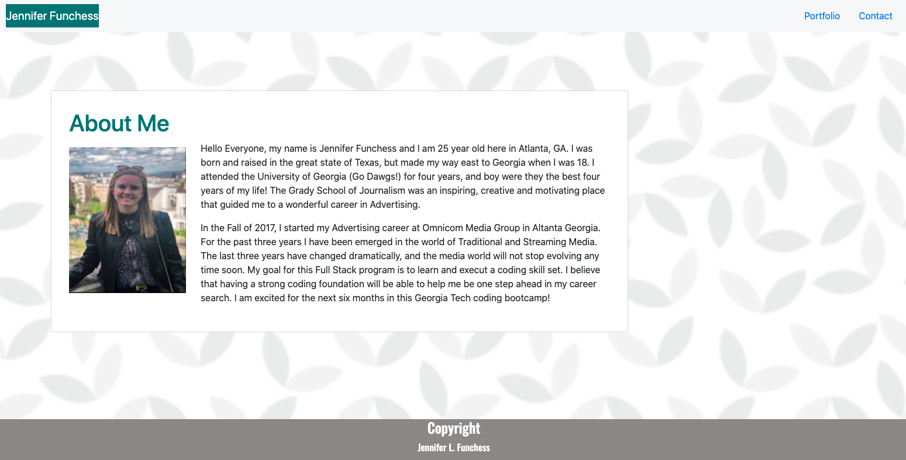

# JenniferFunchess-portfolio-2020

# horiseon-code-refactor
Description

It is finally that time in my career to create an online portfolio. This exercise called for creating from scratch an online portfolio which is made up of three different HTML sheets and a style.css document. 

The process I took to create my online portfolio is first creating three HTML documents. Once I had my navigation bar, sticky footer and background completed on the Index.html (home) page, I was able to create a CSS sheet and make sure all three web browsers are identical. Once I uploaded everything the webpages have in common, it was time to personalize each one. I added a personal photo and an "About Me" section to the main page. I added a contact form to the Contact page. Lastly, I added stand in portfolio pictures to the portfolio page. Once I completed the documents, I went through to make sure all div tags were updated to semantic tags and all the HTML code was validated. 

It is important to be able to create an online website to look identical to the client's design request. If we are able to examine a design, create the code from scratch and be able to push the website live, we are on our ways to becoming web developers! 

Potential future projects for this website would be to add links to each of the portfolio pics and to add java elements to the website as well. 

Acceptance Criteria 

```
* Functional, deployed application
* GitHub repository with README describing the project
* Navbar must be consistent on each page.
* Navbar on each page must contain links to Home/About, Contact, and Portfolio pages.
* All links must work.
* Must use semantic html.
* Each page must have valid and correct HTML. (use a validation service)
* Must contain your personalized information. (bio, name, images, links to social media, etc.)
* Must properly utilize Bootstrap components and grid system.

```

Usage

To be able to view this site you can visit my Github profile. This site is also listed below:

- https://github.com/JenniferFunchess/JenniferFunchess-portfolio-2020

- https://jenniferfunchess.github.io/JenniferFunchess-portfolio-2020/

__

Below are photos of the completed webpage broswers:




Credits

Thank you to each of the websites below for their help in completeing this assignment. 

https://www.w3schools.com/html/html5_semantic_elements.asp

https://learn.shayhowe.com/html-css/positioning-content/

https://css-tricks.com/all-about-floats/

https://wave.webaim.org


HTML Validation

Each HTML document along with the CSS stylesheet has been validated and corrected with help of:
https://validator.w3.org/nu/#textarea

Contributing

Thank you to my wonderful tutor, Sean Brown-Byfield, for helping me with this assignment! 